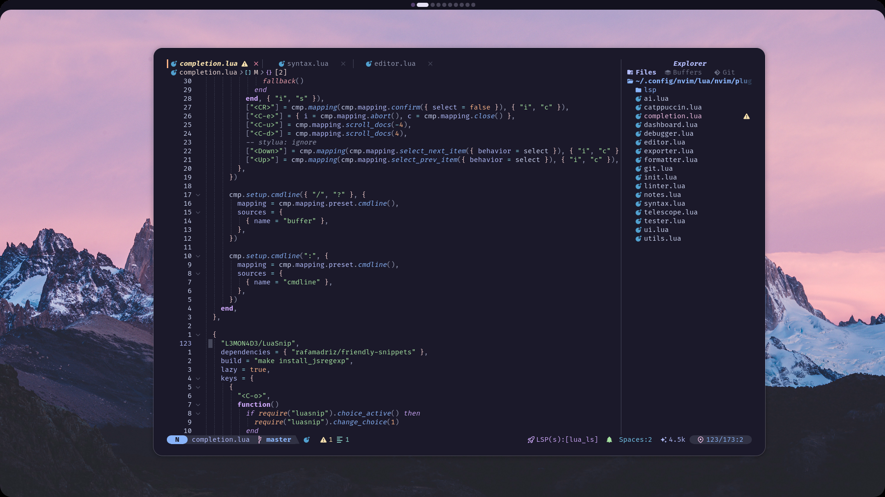

# Nvim Configuration

My Neovim configuration mostly for rust, python, go and c.

## Features

-  UI with Catppuccin theme
-  LSP support with auto-completion
-  Fuzzy finding with Telescope
-  File explorer with Neo-tree
-  Debugging support with DAP
-  Testing integration
-  Git integration
-  Format & Lint support
-  Lazy loading for fast startup

##  Prerequisites

- Neovim >= 0.9.0
- Git
- A C compiler (for building tree-sitter)
- [ripgrep](https://github.com/BurntSushi/ripgrep) (for Telescope)
- A [Nerd Font](https://www.nerdfonts.com/) (for icons)
- Node.js (for LSP servers)
- fd (for fuzzy finding)

##  Installation

1. Backup your existing Neovim configuration:
2. git clone https://github.com/fruitsaladchan/nvim.git ~/.config/nvim
3. nvim

## keybinds

### General
- `<leader>pl` → Open Lazy
- `<leader>pm` → Open Mason 
- `<leader>tt` → Open terminal
- `<C-n>` → Open neo-tree
- `<leader>mp` → Markdown preview
- `<leader>gg` → Open lazygit

### Window Management
- `<leader>-` → Split window horizontally
- `<leader>|` → Split window vertically
- `<A-arrows>` → Resize windows

### Code
- `<leader>cd` → Show line diagnostics
- `[d/]d` → Previous/next diagnostic
- `[e/]e` → Previous/next error
- `[w/]w` → Previous/next warning
- `<leader>cf` → Format code (Code will also formart on save aswell)
- `<C-a>` → Open aerial

### UI Toggles
- `<leader>oh` → Toggle inlay hints
- `<leader>os` → Toggle spell check
- `<leader>on` → Toggle line numbers
- `<leader>ow` → Toggle word wrap

### buffers
- `<S-h>` → Left buffer
- `<S-l>` → Right buffer

### notifications
- `<leader>nd` → Dismiss all
- `<leader>nd` → notification history

### telescope
- `<leader>ff` → Find files
- `<leader>fb` → List buffers
- `<leader>fg` → Fuzzy grep
- `<leader>fr` → Recent files
- `<leader>fn` → Neovim config files

### screenshots
 
 
 
